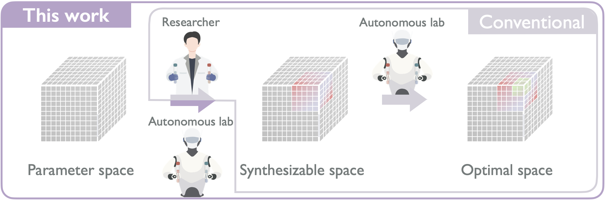

# SPACESHIP: Synthesizable Parameter Acquisition via Closed-loop Exploration and Self-directed, Hardware-aware Intelligent Protocols for autonomous labs.

SPACESHIP is a flexible and modular framework for autonomous material synthesis. It integrates probabilistic models with hardware-aware experimentation protocols to identify synthesizable regions in high-dimensional parameter spaces — without prior constraints.



##  Key Features
- **Parameter Space Definition**: Constructs the experimental parameter space by integrating chemical formulation constraints with hardware-specific capabilities.
- **Synthesizable Space Mapping**: Identifies and iteratively refines the synthesizable regions through closed-loop experimentation and model-guided prediction.
- **Uncertainty-Aware Acquisition**: Actively selects informative experiments based on model uncertainty, enabling efficient exploration of under-characterized or high-risk regions.

---

## 📁 Project Structure

```
SPACESHIP/
├── ParameterSpace.py                # Defines experimental parameter space (must run first)
├── SynthesizableSpace.py           #  – Main synthesis prediction module
├── BaseModel/                      # Collection of baseline and probabilistic models
│   ├── logistic.py, mlp.py, xgboost.py
│   ├── gpclassifier.py, vgpclassifier.py
│   └── VIME/
```

---

## ⚙️ Usage Instructions

1. **Step 1** – Define parameter constraints:

```bash
python ParameterSpace.py
```

2. **Step 2** – Explore synthesizable space:

```bash
python SynthesizableSpace.py  
```

> Make sure to run `ParameterSpace.py` first to initialize or load experimental bounds.

---


## 🔧 Installation & Requirements

Python ≥ 3.8 and the following packages are recommended:

```bash
pip install torch gpytorch scikit-learn xgboost numpy pandas matplotlib
```

---

## 📄 License & Contact

This repository is for academic and research use only.  
For questions, please contact:

**Nayeon Kim** – Korea Institute of Science and Technology / Korea University
📧 Email: kny@kist.re.kr
